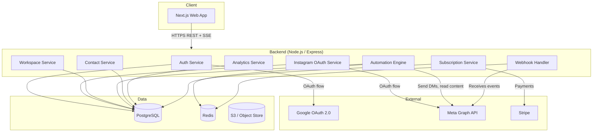
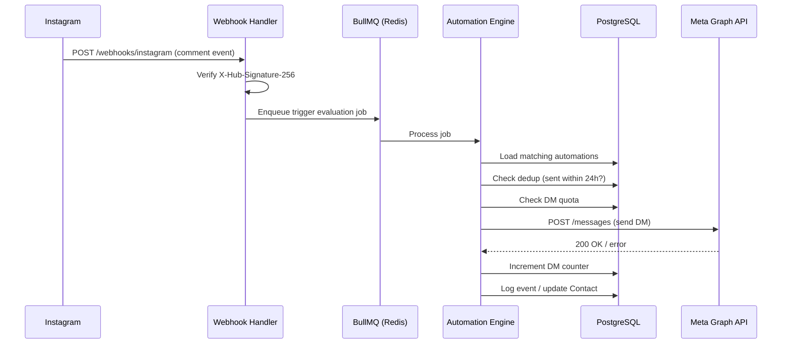

# Design Document: Instagram Automation Platform

## Overview

The Instagram Automation Platform is a multi-tenant SaaS application that allows content creators and businesses to automate Instagram engagement. Users sign in via Google OAuth, connect their Instagram accounts via Meta OAuth, and build automation rules that respond to comments, story replies, and DMs with automated DM flows containing links, email gates, and follow gates.

The platform is organized around the concept of a **Workspace** — each user gets a default workspace that holds their linked Instagram accounts, automations, contacts, and analytics. A tiered subscription model (Free, Pro, Growth) governs feature access and monthly DM quotas. Add-on DM packs provide additional credits without requiring a plan upgrade.

### Key Architectural Goals

- **Event-driven automation engine**: Instagram webhooks drive real-time trigger evaluation and DM delivery.
- **Multi-tenant isolation**: All data is scoped to a Workspace; cross-workspace data leakage is prevented at the data layer.
- **Reliable delivery**: Retry logic with exponential backoff ensures DMs are delivered even under transient API failures.
- **Rate-limit compliance**: Meta API rate limits are respected proactively; the system backs off gracefully on 429 responses.
- **Plan enforcement**: Feature gating and quota enforcement happen at the service layer, not just the UI.

---

## Architecture

The platform follows a **monolithic-first architecture** deployed on a single backend service, with clear internal service boundaries. This allows rapid iteration while maintaining the ability to extract microservices later if scaling demands it.



### Technology Stack

| Layer | Choice | Rationale |
|-------|--------|-----------|
| Frontend | Next.js (React) + TypeScript | SSR for initial load performance, App Router for nested layouts |
| Backend API | Node.js + Express + TypeScript | Rapid iteration, rich Meta SDK ecosystem |
| Database | PostgreSQL | Relational model fits workspace/automation hierarchy; ACID for quota enforcement |
| Cache / Queue | Redis | Trigger deduplication (24hr window), rate-limit state, async job queues |
| Job Queue | BullMQ (Redis-backed) | DM send jobs, Rewind batch processing, token refresh |
| Payments | Stripe | Subscription lifecycle, one-time add-on purchases |
| File Storage | S3-compatible | Contact CSV exports |
| Deployment | Docker + cloud provider (e.g., Render / Railway / AWS ECS) | Containerized for portability |

### Request Flow



---

## Components and Interfaces

### Auth Service

Responsible for Google OAuth sign-in and session management.

**Endpoints:**
- `GET /auth/google` — Initiates Google OAuth redirect
- `GET /auth/google/callback` — Handles OAuth callback, creates/retrieves User, issues session cookie
- `POST /auth/signout` — Invalidates session
- `GET /auth/me` — Returns current session User

**Session Strategy:** HTTP-only, SameSite=Strict signed session cookie (via `express-session` + Redis store). JWT is avoided to simplify session revocation.

### Instagram OAuth Service

Responsible for linking Instagram accounts to Workspaces.

**Endpoints:**
- `GET /instagram/connect` — Initiates Instagram OAuth redirect (requires auth session)
- `GET /instagram/callback` — Handles Meta callback, exchanges code, stores token, links account
- `DELETE /instagram/accounts/:id` — Unlinks Instagram account, revokes token, deactivates automations

**Token Refresh:** A cron job (via BullMQ repeatable job) runs every 12 hours to proactively refresh tokens expiring within 48 hours. On refresh failure, the system marks the account as `token_invalid` and sends an in-app notification.

### Workspace Service

**Endpoints:**
- `GET /workspaces/current` — Returns active workspace with plan, DM usage, linked accounts
- `POST /workspaces` — Create additional workspace (future extensibility)
- `GET /workspaces/:id/usage` — Returns DM quota status

### Automation Engine

The core domain service. Handles Automation CRUD, trigger evaluation, and DM dispatch.

**Endpoints:**
- `GET /automations` — List automations for workspace
- `POST /automations` — Create automation
- `PUT /automations/:id` — Update automation
- `DELETE /automations/:id` — Delete automation (with confirmation)
- `POST /automations/:id/pause` — Pause automation
- `POST /automations/:id/resume` — Resume automation
- `POST /automations/:id/rewind` — Initiate Rewind flow

**Webhook Handler:**
- `POST /webhooks/instagram` — Receives Meta webhook events (comments, story replies, DMs)
- `GET /webhooks/instagram` — Webhook verification challenge endpoint

### Contact Service

**Endpoints:**
- `GET /contacts` — List contacts for workspace (paginated, searchable)
- `GET /contacts/stats` — Aggregate stats (total, with email, active today)
- `GET /contacts/export` — Generate CSV (Pro/Growth only)

### Analytics Service

**Endpoints:**
- `GET /analytics/overview` — Aggregate metrics (DMs sent, link clicks, leads) with date range
- `GET /analytics/automations` — Per-automation performance table
- `GET /analytics/audience` — Audience insights (commenters, geo)
- `GET /analytics/content` — Top content by DMs sent

### Subscription Service

**Endpoints:**
- `GET /billing/plans` — Returns available plans with pricing
- `POST /billing/subscribe` — Creates Stripe checkout session for plan
- `POST /billing/addon` — Creates Stripe checkout session for DM add-on
- `POST /billing/portal` — Returns Stripe billing portal URL
- `POST /webhooks/stripe` — Handles Stripe webhook events (payment confirmation, cancellation)

### Webhook Handler

Receives Meta platform webhooks. Must respond within 20 seconds to avoid Meta marking the endpoint as failed.

The handler does minimal processing: signature verification, event parsing, then enqueues a job to BullMQ. Heavy processing is offloaded to workers.

---

## Data Models

### User

```sql
CREATE TABLE users (
    id            UUID PRIMARY KEY DEFAULT gen_random_uuid(),
    google_id     TEXT NOT NULL UNIQUE,
    email         TEXT NOT NULL UNIQUE,
    name          TEXT NOT NULL,
    avatar_url    TEXT,
    created_at    TIMESTAMPTZ NOT NULL DEFAULT NOW(),
    updated_at    TIMESTAMPTZ NOT NULL DEFAULT NOW()
);
```

### Workspace

```sql
CREATE TABLE workspaces (
    id              UUID PRIMARY KEY DEFAULT gen_random_uuid(),
    owner_id        UUID NOT NULL REFERENCES users(id),
    name            TEXT NOT NULL,
    plan            TEXT NOT NULL DEFAULT 'free' CHECK (plan IN ('free', 'pro', 'growth')),
    billing_cycle   TEXT CHECK (billing_cycle IN ('monthly', 'yearly')),
    stripe_customer_id       TEXT,
    stripe_subscription_id   TEXT,
    dm_quota_monthly         INT NOT NULL DEFAULT 500,
    dm_sent_current_period   INT NOT NULL DEFAULT 0,
    dm_addon_credits         INT NOT NULL DEFAULT 0,
    quota_period_start       TIMESTAMPTZ NOT NULL DEFAULT date_trunc('month', NOW()),
    created_at      TIMESTAMPTZ NOT NULL DEFAULT NOW(),
    updated_at      TIMESTAMPTZ NOT NULL DEFAULT NOW()
);
```

### InstagramAccount

```sql
CREATE TABLE instagram_accounts (
    id                UUID PRIMARY KEY DEFAULT gen_random_uuid(),
    workspace_id      UUID NOT NULL REFERENCES workspaces(id) ON DELETE CASCADE,
    instagram_user_id TEXT NOT NULL,
    username          TEXT NOT NULL,
    access_token      TEXT NOT NULL,          -- encrypted at rest
    token_expires_at  TIMESTAMPTZ,
    token_status      TEXT NOT NULL DEFAULT 'active' CHECK (token_status IN ('active', 'token_invalid', 'revoked')),
    page_id           TEXT,                   -- Meta Page ID if linked
    created_at        TIMESTAMPTZ NOT NULL DEFAULT NOW(),
    updated_at        TIMESTAMPTZ NOT NULL DEFAULT NOW(),
    UNIQUE(workspace_id, instagram_user_id)
);
```

### Automation

```sql
CREATE TABLE automations (
    id                  UUID PRIMARY KEY DEFAULT gen_random_uuid(),
    workspace_id        UUID NOT NULL REFERENCES workspaces(id) ON DELETE CASCADE,
    instagram_account_id UUID NOT NULL REFERENCES instagram_accounts(id),
    name                TEXT NOT NULL,
    status              TEXT NOT NULL DEFAULT 'paused' CHECK (status IN ('live', 'paused')),
    trigger_type        TEXT NOT NULL CHECK (trigger_type IN ('comment', 'story_reply', 'dm')),
    trigger_config      JSONB NOT NULL DEFAULT '{}',
    action_type         TEXT NOT NULL CHECK (action_type IN ('send_dm', 'email_gate', 'follow_gate')),
    action_config       JSONB NOT NULL DEFAULT '{}',
    dm_sent_count       INT NOT NULL DEFAULT 0,
    link_click_count    INT NOT NULL DEFAULT 0,
    template_id         UUID REFERENCES templates(id),
    created_at          TIMESTAMPTZ NOT NULL DEFAULT NOW(),
    updated_at          TIMESTAMPTZ NOT NULL DEFAULT NOW()
);
```

**trigger_config shape (comment):**
```json
{
  "post_id": "17841234567890",
  "post_url": "https://www.instagram.com/p/...",
  "post_thumbnail": "https://...",
  "keywords": ["link", "info", "send me"]
}
```

**action_config shape (send_dm):**
```json
{
  "message": "Hey! Here's the link you asked for:",
  "url": "https://example.com/product",
  "gate": null
}
```

**action_config shape (email_gate):**
```json
{
  "message": "Drop your email to get the link!",
  "gate": "email",
  "prompt": "Enter your email to receive the link",
  "url": "https://example.com/product"
}
```

**action_config shape (follow_gate):**
```json
{
  "message": "Follow us first, then we'll send the link!",
  "gate": "follow",
  "url": "https://example.com/product"
}
```

### AutomationEvent

```sql
CREATE TABLE automation_events (
    id               UUID PRIMARY KEY DEFAULT gen_random_uuid(),
    automation_id    UUID NOT NULL REFERENCES automations(id) ON DELETE CASCADE,
    workspace_id     UUID NOT NULL REFERENCES workspaces(id),
    event_type       TEXT NOT NULL CHECK (event_type IN ('dm_sent', 'dm_failed', 'link_clicked', 'email_collected', 'follow_verified', 'dm_blocked_quota', 'dm_blocked_dedup')),
    instagram_user_id TEXT NOT NULL,
    instagram_username TEXT,
    metadata         JSONB DEFAULT '{}',
    occurred_at      TIMESTAMPTZ NOT NULL DEFAULT NOW()
);

CREATE INDEX idx_automation_events_automation_id ON automation_events(automation_id);
CREATE INDEX idx_automation_events_workspace_id ON automation_events(workspace_id);
CREATE INDEX idx_automation_events_occurred_at ON automation_events(occurred_at);
```

### Contact

```sql
CREATE TABLE contacts (
    id                UUID PRIMARY KEY DEFAULT gen_random_uuid(),
    workspace_id      UUID NOT NULL REFERENCES workspaces(id) ON DELETE CASCADE,
    instagram_user_id TEXT NOT NULL,
    instagram_username TEXT NOT NULL,
    email             TEXT,
    first_seen_at     TIMESTAMPTZ NOT NULL DEFAULT NOW(),
    last_seen_at      TIMESTAMPTZ NOT NULL DEFAULT NOW(),
    interaction_count INT NOT NULL DEFAULT 1,
    UNIQUE(workspace_id, instagram_user_id)
);

CREATE INDEX idx_contacts_workspace_id ON contacts(workspace_id);
CREATE INDEX idx_contacts_email ON contacts(email) WHERE email IS NOT NULL;
CREATE INDEX idx_contacts_username ON contacts(instagram_username);
```

### RewindLog

```sql
CREATE TABLE rewind_logs (
    id               UUID PRIMARY KEY DEFAULT gen_random_uuid(),
    workspace_id     UUID NOT NULL REFERENCES workspaces(id) ON DELETE CASCADE,
    automation_id    UUID NOT NULL REFERENCES automations(id),
    post_id          TEXT NOT NULL,
    comments_found   INT NOT NULL,
    dms_sent         INT NOT NULL,
    status           TEXT NOT NULL CHECK (status IN ('pending', 'processing', 'complete', 'cancelled')),
    initiated_at     TIMESTAMPTZ NOT NULL DEFAULT NOW(),
    completed_at     TIMESTAMPTZ
);
```

### Template

```sql
CREATE TABLE templates (
    id               UUID PRIMARY KEY DEFAULT gen_random_uuid(),
    name             TEXT NOT NULL,
    category         TEXT NOT NULL CHECK (category IN ('featured', 'engage_audience', 'sell_earn', 'capture_leads', 'book_clients')),
    trigger_type     TEXT NOT NULL,
    trigger_config   JSONB NOT NULL DEFAULT '{}',
    action_type      TEXT NOT NULL,
    action_config    JSONB NOT NULL DEFAULT '{}',
    is_system        BOOLEAN NOT NULL DEFAULT TRUE,
    sort_order       INT NOT NULL DEFAULT 0,
    created_at       TIMESTAMPTZ NOT NULL DEFAULT NOW()
);
```

### DmDeduplication (Redis)

Stored in Redis as a SET key per automation:

```
Key:   dedup:{automation_id}:{instagram_user_id}
Value: 1
TTL:   86400 seconds (24 hours)
```

Before sending any DM, the engine checks this key. If it exists, the DM is skipped. On successful send, the key is SET with 24-hour TTL.

### RateLimitState (Redis)

```
Key:   ratelimit:{instagram_account_id}:paused_until
Value: ISO timestamp
TTL:   dynamic (set from API error response)
```

---

## Correctness Properties

*A property is a characteristic or behavior that should hold true across all valid executions of a system — essentially, a formal statement about what the system should do. Properties serve as the bridge between human-readable specifications and machine-verifiable correctness guarantees.*


### Property 1: OAuth Callback User Upsert Idempotency

*For any* valid Google OAuth callback payload containing a given `google_id`, processing the callback any number of times should produce exactly one User record with that `google_id` — never duplicate users, never lost data.

**Validates: Requirements 1.3**

---

### Property 2: Protected Routes Reject Invalid Sessions

*For any* authenticated API endpoint in the platform, a request carrying no session cookie or an expired/invalid session should be rejected with a 401 response (or redirect to sign-in) regardless of which endpoint is called.

**Validates: Requirements 1.5**

---

### Property 3: Instagram OAuth Account Linking Upsert Idempotency

*For any* valid Meta OAuth callback payload containing a given `instagram_user_id` and `workspace_id`, processing the callback any number of times should produce exactly one `InstagramAccount` record associated with that workspace — never duplicates.

**Validates: Requirements 2.2**

---

### Property 4: Account Invalidation Pauses All Associated Automations

*For any* `instagram_account_id`, whenever that account becomes invalid — whether due to failed token refresh or explicit user removal — all automations associated with that account should transition to `paused` status with none left in `live` status.

**Validates: Requirements 2.6, 2.7**

---

### Property 5: Token Refresh Job Targets All Near-Expiry Accounts

*For any* `instagram_account` with `token_status = 'active'` and `token_expires_at` within 48 hours of the current time, the token refresh job should attempt a refresh for that account on each scheduled run.

**Validates: Requirements 2.5**

---

### Property 6: Plan-Based Instagram Account Limit Enforcement

*For any* workspace at its plan's maximum number of linked Instagram accounts, attempting to link one additional account should be rejected — regardless of what the new account is.

**Validates: Requirements 3.2**

---

### Property 7: Workspace Data Isolation

*For any* list or query endpoint that returns workspace-scoped records (automations, contacts, analytics events), all records in the response should have a `workspace_id` matching the authenticated user's active workspace — no records from other workspaces should appear.

**Validates: Requirements 3.5**

---

### Property 8: Keyword Matching Correctness

*For any* comment text and keyword list, the keyword matching function should return:
- `true` if the keyword list is empty (match everything), OR
- `true` if at least one keyword from the list appears in the comment text (case-insensitive substring match)
- `false` otherwise

**Validates: Requirements 6.3, 6.4**

---

### Property 9: DM Deduplication Within 24-Hour Window

*For any* `automation_id` and `instagram_user_id`, if a `dm_sent` event already exists for that pair within the last 24 hours, then triggering the automation again for that same user should result in a `dm_blocked_dedup` event — never a second DM send within the window.

**Validates: Requirements 6.8**

---

### Property 10: DM Retry Exhaustion Logging

*For any* DM send attempt that fails with an Instagram API error on all 3 retry attempts, the system should record exactly one `dm_failed` event for that attempt — never silently dropped, never logged more than once.

**Validates: Requirements 7.6**

---

### Property 11: Contact Upsert Idempotency

*For any* sequence of automation interactions originating from the same `instagram_user_id` within a workspace, exactly one Contact record should exist for that user after all interactions are processed. The record's `interaction_count` should equal the total number of interactions, and `last_seen_at` should reflect the most recent one.

**Validates: Requirements 11.1**

---

### Property 12: Contact Search Result Correctness

*For any* search query string, all contacts returned by the search endpoint should satisfy: `instagram_username ILIKE '%query%' OR email ILIKE '%query%'` — no contacts that don't match the query should appear in results.

**Validates: Requirements 11.4**

---

### Property 13: Rewind Deduplication

*For any* set of historical comments on a post, the Rewind scanner should return only the subset of commenters who have not already received a DM from the selected automation — the intersection of "comments matching keywords" and "never DM'd by this automation" should be empty in the output.

**Validates: Requirements 12.3**

---

### Property 14: DM Quota Invariant

*For any* workspace, the value of `dm_sent_current_period` should never exceed `dm_quota_monthly + dm_addon_credits`. Furthermore, each successful DM delivery should increment `dm_sent_current_period` by exactly 1 (atomic, no double-counts, no missed counts).

**Validates: Requirements 15.3, 17.1**

---

### Property 15: Quota Depletion Order (Plan Before Add-On)

*For any* workspace with remaining plan quota `R = dm_quota_monthly - dm_sent_current_period` and add-on credits `A = dm_addon_credits`, the available DMs for sending should be:
- `R` if `R > 0` (plan quota consumed first)
- `A` if `R <= 0` (add-on consumed only after plan is exhausted)
- `0` if both are exhausted

**Validates: Requirements 16.4**

---

### Property 16: Add-On Credits Stack Additively

*For any* sequence of DM add-on pack purchases for a workspace, the final `dm_addon_credits` value should equal the sum of all purchased pack sizes minus the credits consumed since purchase. After a sequence of pure purchases (no consumption), credits should equal the arithmetic sum of all pack quantities.

**Validates: Requirements 16.5**

---

## Error Handling

### Authentication Errors

| Scenario | Behavior |
|----------|----------|
| Google OAuth error / denial | Redirect to `/signin?error=<code>` with user-friendly message |
| Session expired | 401 response from API; frontend redirects to `/signin` |
| Invalid session cookie | 401 response; session cleared |

### Instagram API Errors

| Scenario | Behavior |
|----------|----------|
| Token refresh failure | Mark account `token_invalid`, pause automations, create in-app notification |
| 429 Rate Limit on DM send | Set `ratelimit:{account_id}:paused_until` in Redis; resume after specified delay |
| 5xx errors on DM send | Retry up to 3 times with exponential backoff (1s, 2s, 4s); log `dm_failed` after exhaustion |
| Webhook signature invalid | Return 403, log warning, discard event |
| Content fetch failure (posts/stories) | Surface error in UI with retry button; do not fail silently |

### Quota Errors

| Scenario | Behavior |
|----------|----------|
| DM quota exhausted | Block DM send, log `dm_blocked_quota`, show in-app banner to user |
| Plan limit on account linking | Return 403 with upgrade prompt payload |
| Rewind would exceed quota | Show warning with exact overage; allow partial send or cancel |

### Payment Errors

| Scenario | Behavior |
|----------|----------|
| Stripe payment failure | Keep current plan; show payment failure notification |
| Stripe webhook delivery failure | Stripe retries automatically; idempotency keys prevent double-credits |
| Plan downgrade | Applied at billing period end; no immediate access revocation |

### General API Error Format

All API errors return a consistent JSON shape:

```json
{
  "error": {
    "code": "QUOTA_EXHAUSTED",
    "message": "Your monthly DM quota has been reached.",
    "details": {
      "plan": "free",
      "quota": 500,
      "used": 500,
      "upgrade_url": "/billing/plans"
    }
  }
}
```

---

## Testing Strategy

### Overview

The platform uses a **dual testing approach**: unit/integration tests for specific behaviors and error conditions, plus property-based tests for universal correctness properties.

### Property-Based Testing

**Library:** [fast-check](https://github.com/dubzzz/fast-check) (TypeScript-native, well-maintained)

**Configuration:** Minimum 100 runs per property. Each property test is tagged with a comment referencing the design property.

**Tag format:** `Feature: instagram-automation-platform, Property {N}: {property_text}`

Each of the 16 Correctness Properties above maps to exactly one property-based test:

| Property | Test File | Generators Needed |
|----------|-----------|-------------------|
| 1 — OAuth upsert idempotency | `auth.property.test.ts` | `fc.record({ google_id, email, name })` |
| 2 — Protected routes reject sessions | `auth.property.test.ts` | `fc.constantFrom(...protectedRoutes)` |
| 3 — Instagram OAuth upsert idempotency | `instagram-oauth.property.test.ts` | `fc.record({ instagram_user_id, workspace_id })` |
| 4 — Account invalidation pauses automations | `automation-engine.property.test.ts` | `fc.array(fc.record({ automation }))` |
| 5 — Token refresh targets near-expiry | `token-refresh.property.test.ts` | `fc.date()` relative to expiry window |
| 6 — Plan account limit enforcement | `workspace.property.test.ts` | `fc.constantFrom('free','pro','growth')` |
| 7 — Workspace data isolation | `workspace.property.test.ts` | `fc.uuid()` for workspace IDs |
| 8 — Keyword matching correctness | `keyword-matcher.property.test.ts` | `fc.string()`, `fc.array(fc.string())` |
| 9 — DM deduplication | `dedup.property.test.ts` | `fc.uuid()`, `fc.date()` |
| 10 — DM retry exhaustion logging | `automation-engine.property.test.ts` | `fc.record({ automation_id, recipient })` |
| 11 — Contact upsert idempotency | `contact-service.property.test.ts` | `fc.array(fc.record({ instagram_user_id }))` |
| 12 — Contact search correctness | `contact-service.property.test.ts` | `fc.string()`, `fc.array(fc.record({ contact }))` |
| 13 — Rewind deduplication | `rewind.property.test.ts` | `fc.array(fc.record({ comment }))` |
| 14 — DM quota invariant | `quota.property.test.ts` | `fc.integer({ min: 0 })` for counts |
| 15 — Quota depletion order | `quota.property.test.ts` | `fc.integer({ min: 0 })` for plan/addon values |
| 16 — Add-on credits stack additively | `quota.property.test.ts` | `fc.array(fc.constantFrom(1000,2000,3000,5000))` |

### Unit Tests

Unit tests focus on:
- Specific examples of trigger evaluation (comment matches keyword, story reply fires correctly)
- Edge cases: empty keyword list, very long comment text, Unicode keywords
- Error handling: OAuth error codes map to correct user messages
- Template application: template fields are correctly applied to automation builder

### Integration Tests

Integration tests (with mocked Meta/Stripe APIs) cover:
- End-to-end automation trigger → DM send flow
- Rewind flow: scan → confirm → send batch
- Stripe webhook → plan activation / DM add-on credit
- Token refresh cron: accounts refreshed, failures handled
- Webhook signature verification

### Database Tests

- Migration correctness: schema applies cleanly
- Constraint tests: unique constraints on `(workspace_id, instagram_user_id)` for contacts
- Index effectiveness: query plans on contacts search, automation_events range queries

### Frontend Tests

- Component unit tests (Vitest + React Testing Library) for Automation Builder, Contacts table, Analytics charts
- Snapshot tests for Template cards and Pricing page
- E2E tests (Playwright) for critical flows: sign-in, Instagram link, create automation, Rewind

### CI Pipeline

```
1. Type check (tsc --noEmit)
2. Lint (ESLint)
3. Unit + Property tests (vitest --run)
4. Integration tests (vitest --run --project=integration)
5. E2E tests (playwright test)
6. Build (next build)
```
